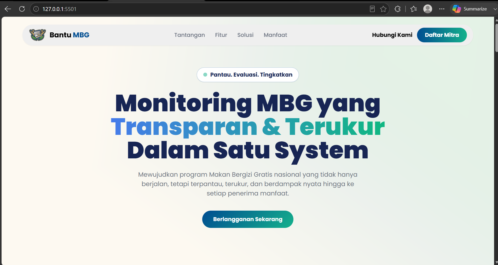
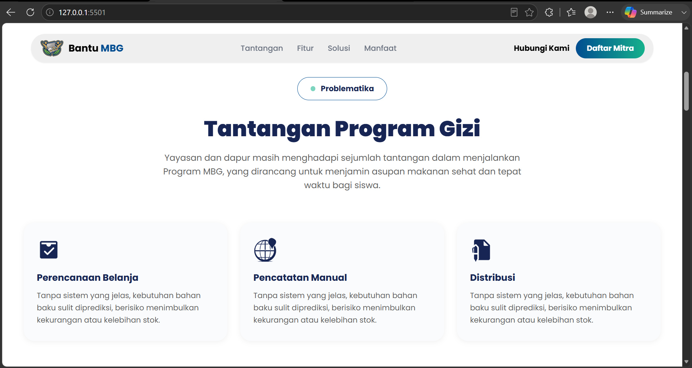
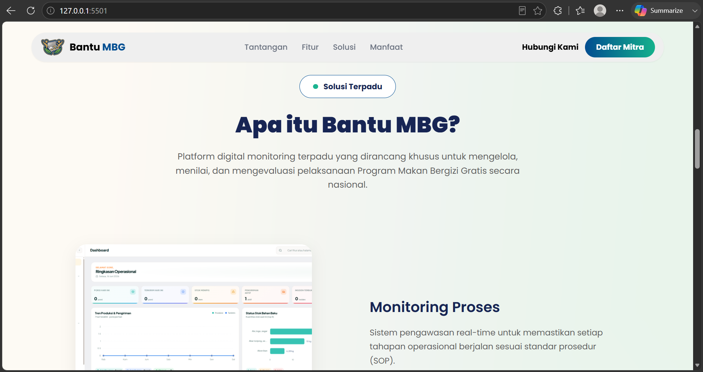
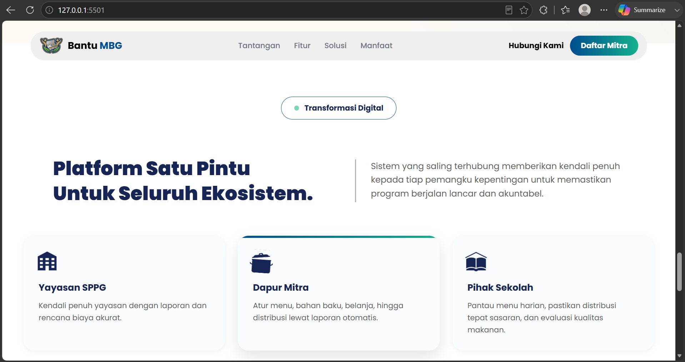
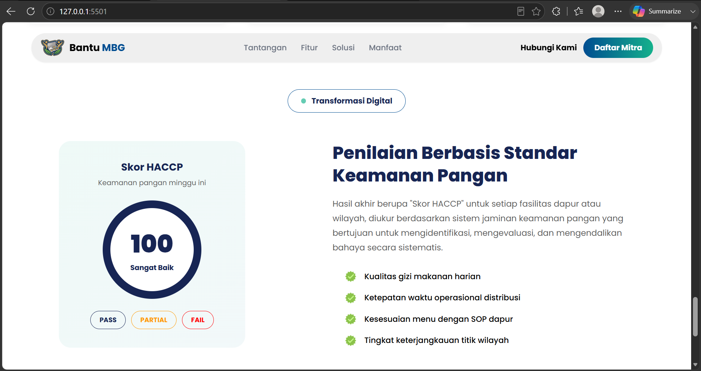
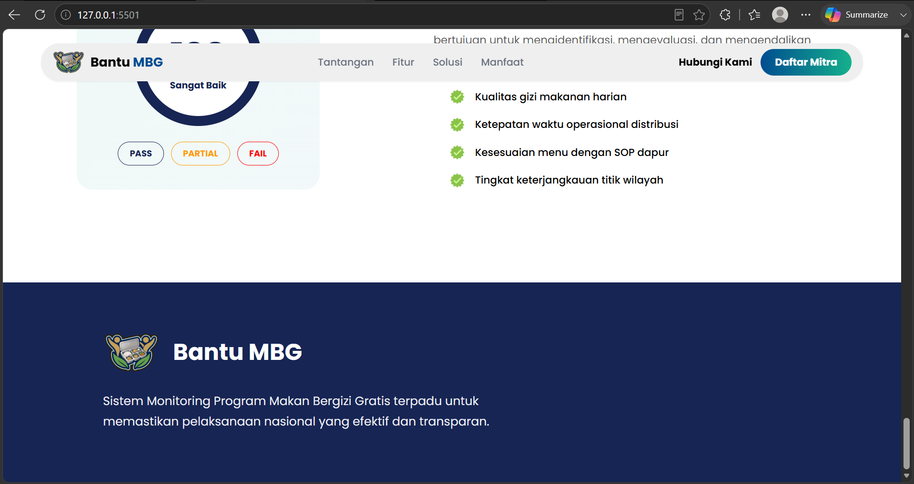

# 🍽️ Bantu MBG
**Bantu MBG** (Monitoring Program Makan Bergizi Gratis), platform digital monitoring terpadu untuk Program Makan Bergizi Gratis nasional.

---

## 📸 Preview

| Section | Preview |
|---------|---------|
| **Page Home** | [] |
| **Page Problematika** | [] |
| **Page Solusi** | [] |
| **Platform Ekosistem** | [] |
| **Penilaian / Assessment** | [] |
| **Footer** | [] |

---

## 🚀 Tech Stack

| Teknologi | Keterangan |
|-----------|------------|
| **HTML5** | Markup semantic |
| **Tailwind CSS** | Utility-first CSS framework (via CDN) |
| **Vanilla JavaScript** | Interaksi & animasi scroll |
| **Google Fonts** | Poppins (400, 500, 600, 700, 900) |

---

## 📁 Struktur File

```text
bantu-mbg-landing/
├── .vscode/              # VS Code settings (opsional)
│
├── assets/               # Folder asset gambar
│   ├── background/
│   │   ├── bghome.png    # Background hero section
│   │   └── bgsolusi.png  # Background solusi section
│   │
│   ├── image-150.png     # Screenshot Fitur: Monitoring Proses
│   ├── image-160.png     # Screenshot Fitur: Perencanaan Menu
│   ├── image-170.png     # Screenshot Fitur: Perencanaan Belanja
│   ├── image-180.png     # Screenshot Fitur: Laporan Digital
│   ├── untitled-1-10.png # Logo Bantu MBG (header)
│   └── untitled-1-11.png # Logo Bantu MBG (footer)
│
├── index.html            # Halaman utama (semua section)
├── style.css             # Custom CSS
├── script.js             # JavaScript interaktif
└── README.md             # Dokumentasi
```
---

## 🎨 Design System

### Warna Utama

| Nama | Hex | Penggunaan |
|------|-----|------------|
| Navy | `#172554` | Headline, judul section |
| Blue | `#004d91` | Accent, link aktif, logo "MBG" |
| Teal | `#15b18c` | Dot badge, accent hover |
| Dark Gray | `#5e5e5e` | Body text |
| Light Gray | `#efefef` | Navbar background |
| Cream | `#fdf9f1` | Hero background |

### Gradient

| Nama | Value | Penggunaan |
|------|-------|------------|
| Primary Gradient | `linear-gradient(90deg, #004d91 0%, #15b18c 100%)` | CTA buttons |
| Text Gradient | `linear-gradient(90deg, #467bea 0%, #10b782 100%)` | Headline "Transparan & Terukur" |

### Tipografi

| Elemen | Font | Weight | Size |
|--------|------|--------|------|
| Logo | Poppins | 700 | 24px |
| Nav Links | Poppins | 500 | 18px |
| "Hubungi Kami" | Poppins | **700** | 18px |
| CTA Button | Poppins | 700 | 18px |
| Hero Headline | Poppins | 900 | 48px–72px (responsive) |
| Hero Description | Poppins | 400 | 16px–18px |
| Section Title | Poppins | 900 | 48px–60px |
| Card Title | Poppins | 700 | 24px–32px |

---

## 📱 Responsive Breakpoints

| Breakpoint | Lebar | Perubahan Utama |
|------------|-------|-----------------|
| Mobile | < 640px | Single column, hamburger menu, font lebih kecil |
| Tablet | 640px – 1024px | 2 columns grid, nav links tetap visible |
| Desktop | > 1024px | Full layout, semua nav links + CTA visible |

---

## ✨ Fitur Interaktif

| Fitur | Deskripsi |
|-------|-----------|
| **Sticky Navbar** | Navbar tetap di atas saat scroll |
| **Navbar Scroll Effect** | Background berubah saat scroll (glassmorphism) |
| **Smooth Scroll** | Klik nav link smooth scroll ke section |
| **Mobile Menu** | Hamburger menu dengan animasi toggle |
| **Scroll Animations** | Fade-in, slide-left, slide-right saat elemen masuk viewport |
| **Hover Effects** | Cards & buttons memiliki efek hover |

---

## 🛠️ Cara Menjalankan

### 1. Clone / Download

```bash
git clone <repo-url>
cd bantu-mbg-landing